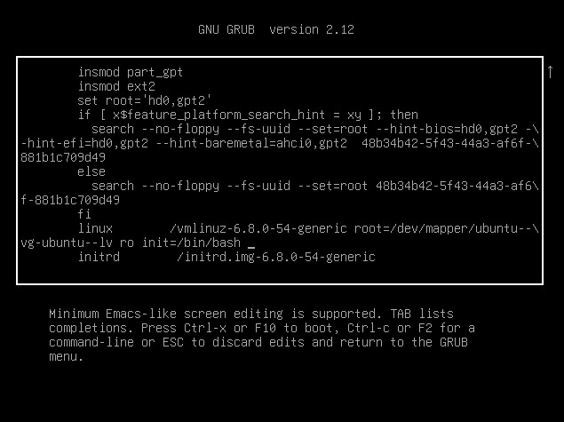
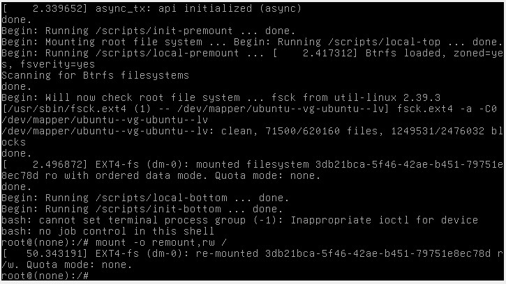

# Включить отображение меню Grub

Для отображения меню нужно отредактировать конфигурационный файл.

>nano /etc/default/grub

Комментируем строку, скрывающую меню и ставим задержку для выбора пункта меню в 10 секунд.

#GRUB_TIMEOUT_STYLE=hidden

GRUB_TIMEOUT=10

Обновляем конфигурацию загрузчика и перезагружаемся для проверки.
>update-grub
<pre>Sourcing file `/etc/default/grub&apos;
Generating grub configuration file ...
Found linux image: /boot/vmlinuz-6.8.0-54-generic
Found initrd image: /boot/initrd.img-6.8.0-54-generic
Warning: os-prober will not be executed to detect other bootable partitions.
Systems on them will not be added to the GRUB boot configuration.
Check GRUB_DISABLE_OS_PROBER documentation entry.
Adding boot menu entry for UEFI Firmware Settings ...
done
</pre>
>reboot

При загрузке в окне виртуальной машины мы должны увидеть меню загрузчика.

Для получения доступа необходимо при выборе ядра для загрузки нажать e - в данном контексте edit. Попадаем в окно, где мы можем изменить параметры загрузки:

# Способ 1. init=/bin/bash

В конце строки, начинающейся с linux, добавляем init=/bin/bash и нажимаем сtrl-x для загрузки в систему

для получение доступа к системев режиме Read-Write, надо воспользоваться командой:

>mount -o remount,rw /

# Установить систему с LVM, после чего переименовать VG

Первым делом посмотрим текущее состояние системы (список Volume Group):

>vgs

<pre>VG        #PV #LV #SN Attr   VSize  VFree
  ubuntu-vg   1   1   0 wz--n- &lt;9.45g    0 
</pre>

Нас интересует вторая строка с именем Volume Group. Приступим к переименованию:

>vgrename ubuntu-vg ubuntu-otus
<pre>Volume group &quot;ubuntu-vg&quot; successfully renamed to &quot;ubuntu-otus&quot;
</pre>
Далее правим /boot/grub/grub.cfg. 
>nano /boot/grub/grub.cfg

Везде заменяем старое название VG на новое 
ubuntu--vg на ubuntu--otus
После чего можем перезагружаться 
>reboot

и, если все сделано правильно, успешно грузимся с новым именем Volume Group и проверяем:

>vgs

<pre> VG          #PV #LV #SN Attr   VSize  VFree
  ubuntu-otus   1   1   0 wz--n- &lt;9.45g    0 
</pre>

Все работает
