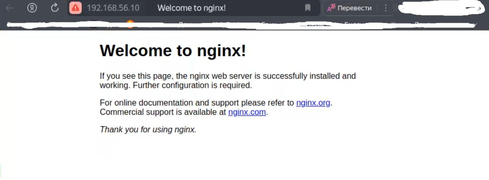

# Основы сбора и хранения логов

После создания вм, заходим на в вм под нзванем web

>wagrant ssh web

<pre> vagrant ssh web
Welcome to Ubuntu 22.04.5 LTS (GNU/Linux 5.15.0-133-generic x86_64)

 * Documentation:  https://help.ubuntu.com
 * Management:     https://landscape.canonical.com
 * Support:        https://ubuntu.com/pro

 System information as of Wed Jul  2 09:07:15 AM UTC 2025

  System load:  0.01               Processes:             140
  Usage of /:   15.8% of 30.34GB   Users logged in:       0
  Memory usage: 16%                IPv4 address for eth0: 10.0.2.15
  Swap usage:   0%

This system is built by the Bento project by Chef Software
More information can be found at https://github.com/chef/bento

Use of this system is acceptance of the OS vendor EULA and License Agreements.
</pre>

проверим, что время и дата указаны правильно: 

>date

<pre>Wed Jul  2 09:07:27 AM UTC 2025
</pre>

Устанавливаем nginx на виртуальной машине web

>sudo -i

>apt update && apt install -y nginx

Проверим, что nginx работает корректно:

>systemctl status nginx

<pre><b>●</b> nginx.service - A high performance web server and a reverse proxy server
     Loaded: loaded (/lib/systemd/system/nginx.service; enabled; vendor preset: enabled)
     Active: <b>active (running)</b> since Wed 2025-07-02 09:12:32 UTC; 2min 21s ago
       Docs: man:nginx(8)
    Process: 3414 ExecStartPre=/usr/sbin/nginx -t -q -g daemon on; master_process on; (code=exited, sta&gt;
    Process: 3415 ExecStart=/usr/sbin/nginx -g daemon on; master_process on; (code=exited, status=0/SUC&gt;
   Main PID: 3507 (nginx)
      Tasks: 3 (limit: 1590)
     Memory: 4.6M
        CPU: 21ms
     CGroup: /system.slice/nginx.service
             ├─3507 &quot;nginx: master process /usr/sbin/nginx -g daemon on; master_process on;&quot;
             ├─3510 &quot;nginx: worker process&quot; &quot;&quot; &quot;&quot; &quot;&quot; &quot;&quot; &quot;&quot; &quot;&quot; &quot;&quot; &quot;&quot; &quot;&quot; &quot;&quot; &quot;&quot; &quot;&quot; &quot;&quot; &quot;&quot; &quot;&quot; &quot;&quot; &quot;&quot; &quot;&quot; &quot;&quot; &quot;&quot;&gt;
             └─3511 &quot;nginx: worker process&quot; &quot;&quot; &quot;&quot; &quot;&quot; &quot;&quot; &quot;&quot; &quot;&quot; &quot;&quot; &quot;&quot; &quot;&quot; &quot;&quot; &quot;&quot; &quot;&quot; &quot;&quot; &quot;&quot; &quot;&quot; &quot;&quot; &quot;&quot; &quot;&quot; &quot;&quot; &quot;&quot;&gt;

Jul 02 09:12:32 web systemd[1]: Starting A high performance web server and a reverse proxy server...
Jul 02 09:12:32 web systemd[1]: Started A high performance web server and a reverse proxy server.
</pre>

>ss -tln | grep 80

<pre>LISTEN 0      511          0.0.0.0:<b>80</b>        0.0.0.0:*          
LISTEN 0      511             [::]:<b>80</b>           [::]:* </pre>

# Настройка центрального сервера сбора логов

Откроем терминал и подключаемся по ssh к ВМ log

>vagrant ssh log

Перейдем в пользователя root

>sudo -i

Проверяем установку rsyslog

>apt list rsyslog

<pre>Listing... Done
rsyslog/jammy-updates,jammy-security,now 8.2112.0-2ubuntu2.2 amd64 [installed,automatic]
N: There is 1 additional version. Please use the &apos;-a&apos; switch to see it
</pre>

Чтобы сервер мог принимать логи, вносим следующие изменения в файл /etc/rsyslog.conf
Открываем порт 514 (TCP и UDP) и добавляем правило приема сообщений

>nano /etc/rsyslog.conf

<pre>
...
# provides UDP syslog reception
module(load=&quot;imudp&quot;)
input(type=&quot;imudp&quot; port=&quot;514&quot;)

# provides TCP syslog reception
module(load=&quot;imtcp&quot;)
input(type=&quot;imtcp&quot; port=&quot;514&quot;)
...

#Add remote logs
$template RemoteLogs,"/var/log/rsyslog/%HOSTNAME%/%PROGRAMNAME%.log"
*.* ?RemoteLogs
& ~

</pre>

соханяем и перегружаем службу

>systemctl restart rsyslog

проверяем порты

>ss -tuln

<pre>Netid    State     Recv-Q    Send-Q          Local Address:Port         Peer Address:Port    Process    
udp      UNCONN    0         0                     0.0.0.0:514               0.0.0.0:*                  
udp      UNCONN    0         0               127.0.0.53%lo:53                0.0.0.0:*                  
udp      UNCONN    0         0              10.0.2.15%eth0:68                0.0.0.0:*                  
udp      UNCONN    0         0                        [::]:514                  [::]:*                  
tcp      LISTEN    0         4096            127.0.0.53%lo:53                0.0.0.0:*                  
tcp      LISTEN    0         128                   0.0.0.0:22                0.0.0.0:*                  
tcp      LISTEN    0         25                    0.0.0.0:514               0.0.0.0:*                  
tcp      LISTEN    0         128                      [::]:22                   [::]:*                  
tcp      LISTEN    0         25                       [::]:514                  [::]:*    </pre>

Далее настроим отправку логов с web-сервера
Заходим на вэб сервер, переходим в root и проверяем версию 

>vagrant ssh web

>sudo -i

>nginx -v

<pre>nginx version: nginx/1.18.0 (Ubuntu)
</pre>

Находим в файле /etc/nginx/nginx.conf раздел с логами и приводим их к следующему виду

>nano /etc/nginx/nginx.conf

<pre>

...
  ##
        # Logging Settings
        ##
        error_log  /var/log/nginx/error.log;
        error_log  syslog:server=192.168.56.15:514,tag=nginx_error;     
        access_log syslog:server=192.168.56.15:514,tag=nginx_access,serverity=info combined;

        ##
...
</pre>

Сохраняем конфигурацию и проверяем

>nginx -t

<pre>nginx: the configuration file /etc/nginx/nginx.conf syntax is ok
nginx: configuration file /etc/nginx/nginx.conf test is successful
</pre>

перезапускаем сервис

>systemctl restart nginx

Попробуем несколько раз зайти по адресу http://192.168.56.10
Потом заходим на log-сервер и смотрим информацию

>cat /var/log/rsyslog/web/nginx_access.log

<pre><b>vagrant@log</b>:<b>~</b>$ cat /var/log/rsyslog/web/nginx_access.log
Jul  8 10:22:45 web nginx_access: 192.168.56.1 - - [08/Jul/2025:10:22:45 +0000] &quot;GET /favicon.ico HTTP/1.1&quot; 404 197 &quot;-&quot; &quot;Mozilla/5.0 (X11; Linux x86_64) AppleWebKit/537.36 (KHTML, like Gecko) Chrome/132.0.0.0 YaBrowser/25.2.0.0 Safari/537.36&quot;
Jul  8 10:22:48 web nginx_access: 192.168.56.1 - - [08/Jul/2025:10:22:48 +0000] &quot;GET / HTTP/1.1&quot; 304 0 &quot;-&quot; &quot;Mozilla/5.0 (X11; Linux x86_64) AppleWebKit/537.36 (KHTML, like Gecko) Chrome/132.0.0.0 YaBrowser/25.2.0.0 Safari/537.36&quot;
Jul  8 10:22:48 web nginx_access: 192.168.56.1 - - [08/Jul/2025:10:22:48 +0000] &quot;GET /favicon.ico HTTP/1.1&quot; 404 197 &quot;http://192.168.56.10/&quot; &quot;Mozilla/5.0 (X11; Linux x86_64) AppleWebKit/537.36 (KHTML, like Gecko) Chrome/132.0.0.0 YaBrowser/25.2.0.0 Safari/537.36&quot;
Jul  8 10:23:12 web nginx_access: 192.168.56.1 - - [08/Jul/2025:10:23:12 +0000] &quot;GET / HTTP/1.1&quot; 304 0 &quot;-&quot; &quot;Mozilla/5.0 (X11; Linux x86_64) AppleWebKit/537.36 (KHTML, like Gecko) Chrome/132.0.0.0 YaBrowser/25.2.0.0 Safari/537.36&quot;
Jul  8 10:23:14 web nginx_access: 192.168.56.1 - - [08/Jul/2025:10:23:14 +0000] &quot;GET / HTTP/1.1&quot; 304 0 &quot;-&quot; &quot;Mozilla/5.0 (X11; Linux x86_64) AppleWebKit/537.36 (KHTML, like Gecko) Chrome/132.0.0.0 YaBrowser/25.2.0.0 Safari/537.36&quot;
</pre>

>cat /var/log/rsyslog/web/nginx_error.log

<pre><b>vagrant@log</b>:<b>~</b>$ cat /var/log/rsyslog/web/nginx_error.log 
cat: /var/log/rsyslog/web/nginx_error.log: No such file or directory
</pre>

файл nginx_error.log не был создан из-за отсутствия ошибок
попробуем переместить файл вэб страницы

>mv /var/www/html/index.nginx-debian.html /var/www/

попробуем зайти снова и получаем ошибку 403

смотрим в лог ошибок сервера log

<pre><b>vagrant@log</b>:<b>~</b>$ cat /var/log/rsyslog/web/nginx_error.log 
Jul  8 10:30:57 web nginx_error: 2025/07/08 10:30:57 [error] 1220#1220: *4 directory index of &quot;/var/www/html/&quot; is forbidden, client: 192.168.56.1, server: _, request: &quot;GET / HTTP/1.1&quot;, host: &quot;192.168.56.10&quot;
Jul  8 10:30:59 web nginx_error: 2025/07/08 10:30:59 [error] 1220#1220: *4 directory index of &quot;/var/www/html/&quot; is forbidden, client: 192.168.56.1, server: _, request: &quot;GET / HTTP/1.1&quot;, host: &quot;192.168.56.10&quot;
</pre>
 